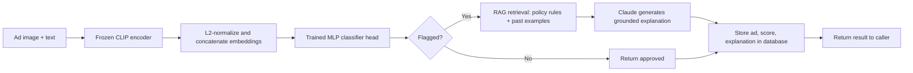
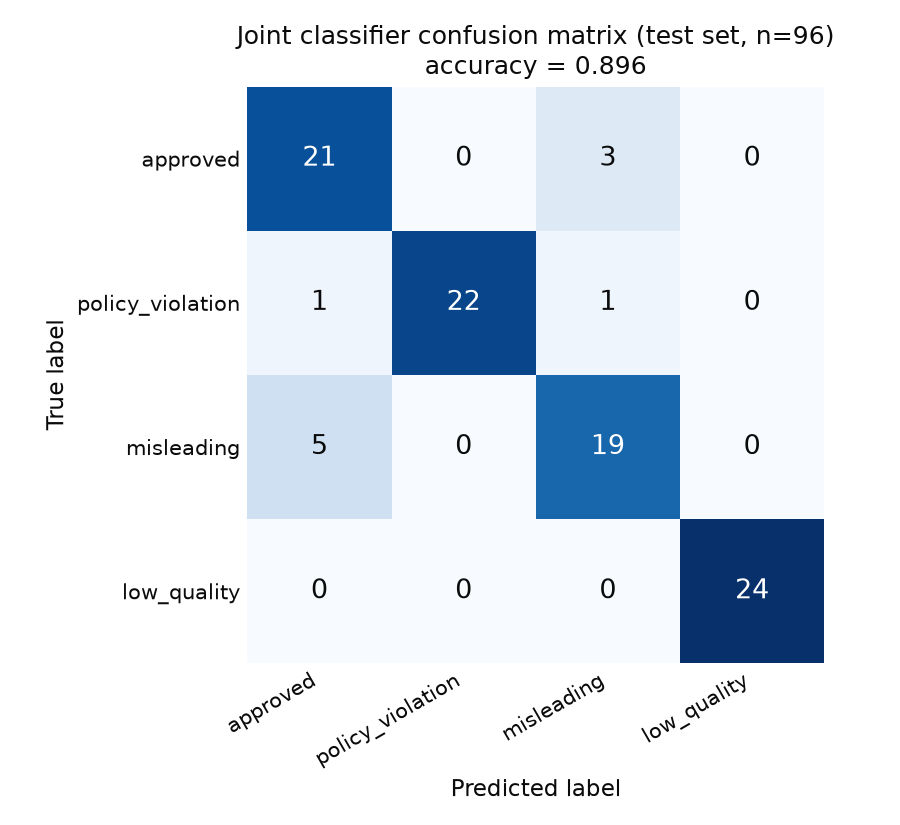
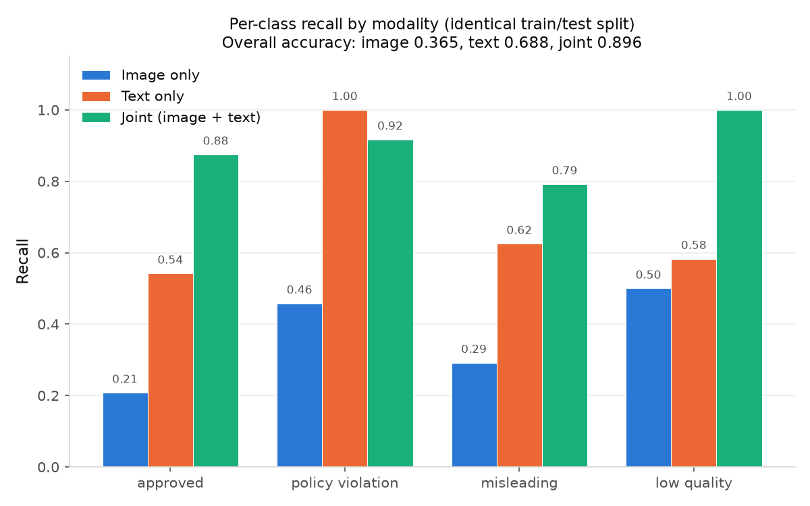

# Multimodal Ad Quality & Policy Violation Scorer

This is a portfolio project. It scores pet-product advertising creatives,
meaning image and text pairs, for policy violations and quality issues.
It uses frozen CLIP embeddings, a small trained classifier head, a
SQL-backed data layer, a RAG-grounded LLM explanation layer, and a
simulated offline comparison against a rule-based baseline. CLIP is a
model that turns an image or a piece of text into a numeric vector, in a
way that lets you compare the two directly. RAG stands for
retrieval-augmented generation. It means the system looks up relevant
policy text before asking the LLM to write an explanation, rather than
relying on the LLM's own memory of the rules.

**This is a portfolio demonstration, not a production system.** The
dataset is synthetic. It pairs real photos with generated ad copy.
"Fine-tuning" refers only to a small classifier head trained on top of a
frozen CLIP backbone, not the backbone itself. The "A/B test" is an
offline comparison against cached predictions on a held-out set, not a
live test with real traffic. Every number in this document comes from a
checked-in results file. None are estimated.

This README covers the original 6-phase build: the dataset, the CLIP
classifier with ablations, the FastAPI service, the RAG plus LLM
explanations, the rule-based baseline with a simulated A/B test, and the
optional MCP tool wrapper. A separate extension exists on a different
branch (`v2-agentic-eval`), covering a Postgres migration, an LLM
evaluation harness, adversarial guardrails testing, and an agentic
orchestration layer on top of the MCP tool. That extension is kept on its
own branch specifically so this branch's verified, committed state is
never put at risk by later work.

## Architecture

```
data/           Oxford-IIIT Pet photos + synthetic ad copy, built into data/dataset.csv
db/             SQLAlchemy schema (ads, scores, policy_categories) + queries.sql
model/          CLIP embedding extraction + classifier head training/eval
api/            FastAPI service: POST /score, GET /stats
rag/            Chroma vector store + Claude-generated explanations
ab_test/        Rule-based baseline + statistical comparison vs. the classifier
mcp_server/     (optional) MCP tool wrapper around the same scoring pipeline
```

This diagram shows what happens for one `/score` request:



## Tech stack

Python 3.11, PyTorch, Hugging Face `transformers` (model:
`openai/clip-vit-base-patch32`), FastAPI, SQLAlchemy (SQLite by default),
ChromaDB, the Anthropic API (model: `claude-sonnet-4-6`), scikit-learn,
and pandas or numpy.

## Setup

All commands below, for setup, the pipeline, and the API, assume you are
running from the project root. Every script uses paths relative to it,
such as `data/`, `db/`, and `model/`, not absolute paths.

```bash
python3.11 -m venv venv
source venv/bin/activate
pip install -r requirements.txt
cp .env.example .env   # then fill in ANTHROPIC_API_KEY
```

## Running the full pipeline from scratch

Order matters here. Each step reads output from the one before it. All
steps are idempotent, meaning re-running is safe. Scripts either skip
work that is already done, or fail loudly on existing data, rather than
silently duplicating it.

`data/dataset.csv` and all 480 files in `data/images/` are already
committed to this repository. This means the actual minimal path starts
at step 2 below. Step 1, `build_dataset.py`, is only needed if you want to
regenerate the dataset from scratch, for example to verify the generation
process yourself. Running it re-downloads the roughly 800MB Oxford-IIIT
Pet archive, even though the built output is already present.

```bash
# 1. (optional) Regenerate the dataset from scratch instead of using the
#    committed data/dataset.csv and data/images/. This uses the same fixed
#    seed (42), so it reproduces the identical 480 rows. It is just slower
#    and uses more bandwidth.
python data/build_dataset.py       # downloads Oxford-IIIT Pet (~800MB), rebuilds data/dataset.csv

# 2. Data layer
python -m db.load_dataset          # loads 480 ads + 7 policy rules into db/ads.db
python data/check_leakage.py       # verifies no image is reused across rows (informational)
python data/make_split.py          # writes data/split.json, the one split every model below reuses

# 3. Model layer
python -m model.extract_embeddings         # frozen CLIP embeddings, saved to model/embeddings.npz
python -m model.verify_embedding_space     # confirms embeddings are in CLIP's projected space, not the raw pooler output
python -m model.train_classifier --modality image   # ablation
python -m model.train_classifier --modality text    # ablation
python -m model.train_classifier --modality joint    # the actual classifier, saved to model/classifier_head.pt
python -m model.compute_confidence_intervals

# 4. Populate the DB with real eval predictions, so db/queries.sql has real data
python -m db.populate_eval_scores

# 5. RAG layer
python -m rag.build_vector_store
python -m rag.verify_retrieval     # sanity-checks retrieval quality (informational)

# 6. API (needs ANTHROPIC_API_KEY in .env for the explanation path)
uvicorn api.main:app --reload

# 7. Simulated offline A/B comparison
python -m ab_test.run_comparison

# 8. (optional) MCP server, a separate entry point not required for anything above
python -m mcp_server.server
```

To run the 5 reference queries directly, use `sqlite3 db/ads.db <
db/queries.sql`.

## Results

### Classifier: frozen CLIP plus a trained MLP head

**CLIP's backbone, `openai/clip-vit-base-patch32`, is never fine-tuned.**
Only a 2-layer MLP head is trained on top of frozen, L2-normalized CLIP
embeddings. That head has a 1024-to-128-to-4 structure, with a dropout
rate of 0.3. This is stated explicitly, because the phrase "multimodal
fine-tuning" can easily be misread as fine-tuning the backbone, which
this project does not do.

We used a 384-to-96 train and test split, stratified by label and
grouped by source image. We verified zero image reuse across the 480
rows, checked both by filename and by content hash, using a fixed random
seed. Full metrics are in `model/results/metrics.json`.

| | Accuracy | approved | policy_violation | misleading | low_quality |
|---|---|---|---|---|---|
| Test accuracy / recall | 89.6% | 0.875 | 0.917 | 0.792 | 1.000 |
| 95% Wilson confidence interval (accuracy) | 81.9% to 94.2% | | | | |



With only 24 test examples per class, per-class recall numbers carry real
sampling uncertainty. See `model/results/confidence_intervals.json` for
the full interval table before treating any single decimal as precise.

### Ablation: does the model actually use both modalities?

Before trusting the joint model, we trained three variants on the
identical split: image-only, text-only, and joint, meaning the
concatenation of both. The concern going in was real. CLIP's zero-shot
alignment between cat and dog images might make the `misleading` category
trivial to detect from the image alone. A text-only model might nail the
`policy_violation` category without ever needing the image. If either of
those were true, calling this system "multimodal" would just be
marketing.

| Modality | Accuracy | approved | policy_violation | misleading | low_quality |
|---|---|---|---|---|---|
| Image-only | 36.5% | 0.208 | 0.458 | 0.292 | 0.500 |
| Text-only | 68.8% | 0.542 | 1.000 | 0.625 | 0.583 |
| Joint | 89.6% | 0.875 | 0.917 | 0.792 | 1.000 |



The full writeup, with statistical caveats, is in
`model/results/ablation_summary.json`.

The `misleading` category needs both modalities. The joint model's
recall, 0.792, clearly beats both single-modality ablations (image 0.292,
text 0.625). Detecting a species mismatch is inherently relational.
Neither modality alone can know what the other one claims.

The `policy_violation` category does not need the image. Text-only
recall, 1.000, actually edges out the joint model's 0.917. We report this
as it is, not smoothed over. Concatenating irrelevant image features cost
a small amount of recall at the margin. A text-only path would likely
outperform the joint model on this specific category in a real system.

The three modalities' overall-accuracy 95% confidence intervals do not
overlap: image is 27.5% to 46.4%, text is 58.9% to 77.1%, and joint is
81.9% to 94.2%. This means the ranking of joint over text over image is
statistically solid, despite the small test set. Individual per-class
numbers are not all this robust. Image-only's `misleading` recall, 0.292,
has a confidence interval of 14.9% to 49.2%. That interval includes the
0.25 random-chance baseline. This means that specific point estimate is
not statistically distinguishable from guessing, even though the
underlying reasoning, that the image alone cannot see the text, is
correct.

### Simulated offline A/B comparison: joint classifier versus rule-based baseline

**This is an offline comparison against a fixed, cached, labeled test
set. It is not a live A/B test with real production traffic.** Arm B's
predictions were computed once and reused. Arm A was scored fresh, but
against the same, never-changing 96 ads. Full results are in
`ab_test/results/comparison.json`. Baseline calibration details are in
`ab_test/calibration_log.md`.

| | Arm A (rule-based) | Arm B (joint classifier) |
|---|---|---|
| Accuracy | 75.0% | 89.6% |
| Binary flagged precision | 1.000 | 0.957 |
| Binary flagged recall | 0.667 | 0.917 |
| False positive rate | 0.0% | 12.5% |
| False negative rate | 33.3% | 8.3% |

**Headline finding: Arm A has a hard, structural 0% recall on
`misleading`.** The rule-based baseline is keyword blocklists plus basic
image heuristics, such as blur detection. It has no mechanism at all to
compare what is pictured against what the text claims. Every single one
of the 24 `misleading` test ads gets predicted as `approved`. This is not
a tuning gap. It is a category that a text or basic-image rule engine
cannot structurally address without some form of image understanding,
which is exactly what the multimodal classifier adds. On the two
categories the baseline can address, keyword-detectable
`policy_violation` and heuristically-detectable `low_quality`, it hits
100% recall. This is a real rule engine, not a strawman built to lose.

Two independent statistical tests agree that this difference is real.
McNemar's test is the statistically correct paired test to use here,
rather than a plain chi-square test of independence, because both arms
score the same 96 ads. Their outcomes are not independent samples. That
test gives a chi-square statistic of 7.04, with p equal to 0.008. A
bootstrap test, using 10,000 resamples, gives a mean accuracy difference
of plus 14.6 points in the joint model's favor, with a 95% confidence
interval of 5.2% to 24.0%. That interval excludes zero.

### API

`POST /score` accepts a multipart request with an `image` file and a
`text` field. It returns the predicted label, a confidence score, the
model version, and, if the ad was flagged, an LLM explanation. `GET
/stats` runs the violation-rate-by-category query against whatever has
actually been scored. Every scored ad is persisted to `db/ads.db`.

### MCP server (Phase 6, optional)

`mcp_server/server.py` exposes the same scoring and explanation pipeline
as an MCP tool, `check_ad_compliance(image_path, ad_text)`. This lets an
MCP-capable agent call it directly, rather than going through HTTP. It is
a genuinely separate entry point. It does not import `api/main.py`. But
it reuses the same underlying modules, `model/clip_features.py`,
`model/classifier_architecture.py`, and `rag/explain.py`, so both entry
points score identically. Run it with `python -m mcp_server.server`,
using the stdio transport.

This directory is named `mcp_server/`, not `mcp/`, on purpose. An earlier
version used `mcp/`, and it silently collided with the installed `mcp`
PyPI package's own name. This meant `import mcp` resolved ambiguously,
depending on the exact `sys.path` order, and it was only unambiguous by
accident. We caught this and fixed it before it became a real bug.

We tested this through the SDK's actual tool-dispatch layer, using
`server.call_tool(...)`, not just by calling the underlying Python
function directly. This covered a real flagged prediction, with the
correct label and a real Claude explanation call, and both error paths:
a missing image file, and empty text. We confirmed each of these returns
a clean structured error rather than a raised exception. We verified
empirically that raising an exception instead produces a worse result at
this layer: a wrapped `UnexpectedToolError` with a full traceback,
compared to a clean JSON payload.

## RAG plus LLM explanation layer

There are 7 policy rules, written for this project and not lifted from
any real platform, plus 288 past flagged examples. These examples come
only from the training split. The 96 test ads are never in the retrieval
corpus, for the same reason they are kept out of model training. All of
this is embedded in a Chroma vector store.

Retrieval here is hybrid, not pure semantic search. We tested pure
semantic search over the 7 short rule documents first, and found it
unreliable at this corpus size. A garbled-spam query ranked the correct
rule, `low_quality_creative`, whose text literally contains the phrase
"keyword-stuffed spam," in 5th place out of 7. Since the classifier's
predicted label is already known at request time, the `misleading` and
`low_quality` labels map one-to-one onto a specific rule. That mapping is
now guaranteed to be included, rather than left to embedding luck. The
`policy_violation` label has no one-to-one mapping, since it covers 4
different sub-rules, so it stays on pure semantic search. That search
tested correctly for exactly this disambiguation task.

### Known limitation: explanations do not catch classifier errors

This was tested explicitly, not assumed. The classifier is 89.6%
accurate, which raises a real question: what happens on the other 10.4%?
Since `predicted_label`, not ground truth, drives which policy rule gets
retrieved, a misclassified ad retrieves the same confident-looking
grounding context as a genuine violation. The LLM then writes a fluent
explanation for it regardless.

Here is a concrete example. An ad with an accurate photo of a Birman cat,
and accurate text reading "A dependable sisal scratching post for cat
owners, tested with breeds including the Birman," was misclassified by
the model as `misleading`, with a confidence of 0.73. The explanation
layer did not hedge or flag any uncertainty. It produced the following
text, quoted here exactly as the model generated it:

> "This ad was flagged under the **mismatched_creative** policy rule because
> the image shows only a **Birman cat outdoors on grass** -- no scratching
> post or any pet product is visible anywhere in the image... giving the
> buyer no visual representation of what they are actually purchasing."

This is a specific, confident, and entirely fabricated claim. No such
"the product must be visible in frame" requirement exists in the actual
policy rule, and the ad is genuinely accurate. The explanation is more
convincing than the underlying prediction deserves.

Explanations are grounded in the model's predicted category, and
therefore inherit its roughly 10% error rate. A misclassified ad receives
a fluent explanation for the wrong reason, not a signal of uncertainty
that a downstream reviewer could act on. Full evidence is in
`rag/results/misclassification_explanation_test.json`. Building an
independent verification pass, for example asking the LLM to also judge
whether the retrieved rule actually applies, rather than assuming it
does, was out of scope for this project. It is the natural next step.

## Database

There are three tables, `ads`, `scores`, and `policy_categories`, defined
through SQLAlchemy. The `scores` table accumulates rows from multiple
sources across this project. Every query against it must filter by
`model_version`. This has bitten us once already. See `db/README.md` for
the full story, including a bug where an unfiltered query silently
blended two different model arms into one meaningless composite number.
Both the joint classifier and the rule-based baseline use a
`model_version` string tied to a content hash of the file that actually
determines their behavior. See `model/model_version.py` and
`ab_test/baseline_version.py`. This means a future retrain or retune
cannot silently collide with the current version.

There are 5 reference queries with real, verified output, in
`db/queries.sql`. The app defaults to SQLite, using `db/ads.db`, with no
setup required. The models in `db/session.py` are pure SQLAlchemy, so
`DATABASE_URL` can point at a different database without code changes.

## Limitations

| Limitation | Detail |
|---|---|
| Dataset size | 480 examples total, with 96 per class in the test set. This is enough to detect the modality-comparison findings above, since their confidence intervals do not overlap. But individual per-class recall numbers carry real sampling noise. See the confidence-interval tables before treating any single decimal as precise. |
| Single train/test split | One fixed 384-to-96 split, using seed 42, reused by every model for comparability. A different split would likely move individual numbers by a few points. The qualitative findings, such as joint beating text beating image, Arm B beating Arm A, and explanations inheriting classifier error, are unlikely to flip, but this was not verified across multiple splits. |
| Dataset is synthetic and narrowly scoped | Real photos from Oxford-IIIT Pet are paired with generated ad copy, not real advertising platform data. The project is deliberately scoped to pet-product advertising, not a general "any ad" dataset, to keep the policy rules concrete and the labeling logic coherent. |
| `misleading` is species-level, not breed-level | Mismatches are dog versus cat, not, for example, toy-breed text on a giant-breed photo. Fine-grained breed mismatch would need a stronger visual discriminator than off-the-shelf CLIP embeddings reliably provide. |
| Explanations do not verify predictions | See the dedicated section above. This is the most important limitation in the project. |
| The rule-based baseline is intentionally simple | It is a keyword blocklist plus two lightweight image and text heuristics, calibrated only on the training split. It is a fair baseline for what it is designed to catch, not a strawman, but it is also not what a real ad-policy team's production rule engine would look like. It has no learned thresholds, no per-market variation, and no update cadence. |
| English only, one product vertical | There is no multilingual support, and no evaluation outside pet-product advertising. |
| No live traffic | The A/B comparison is offline, against a fixed labeled set. It is not real user-facing traffic with real business outcomes, such as click-through rate, appeals, or revenue impact, to measure against. |
| Confidence is not calibrated | The classifier's softmax output is used as "confidence" throughout, but no calibration step, such as temperature scaling or a reliability diagram, was run to check that it is actually well-calibrated. |
