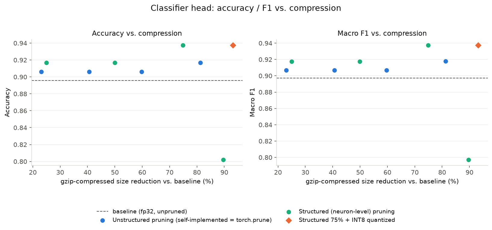
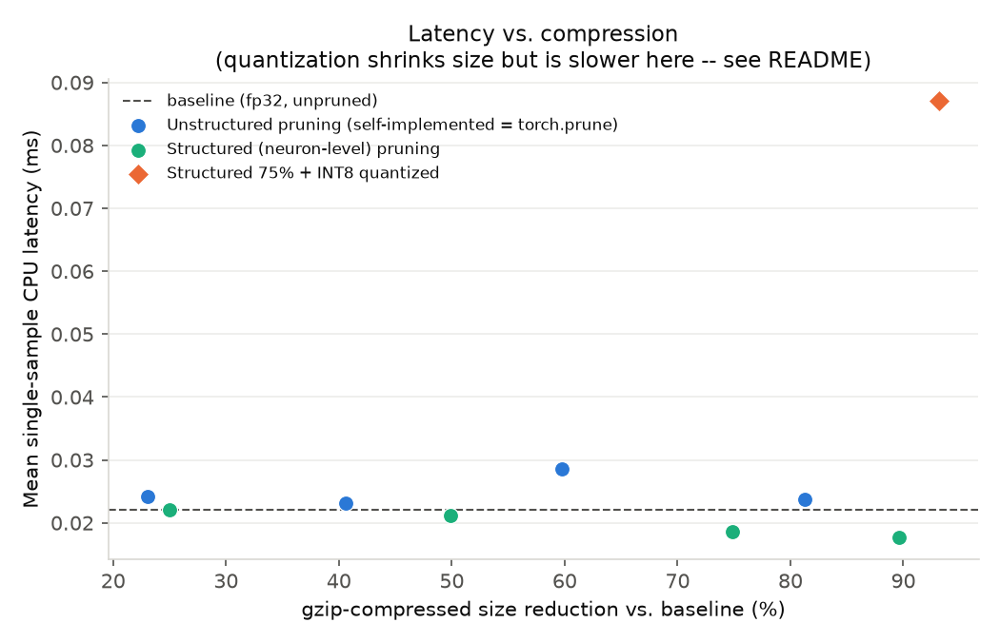

# Model compression and optimization study

This document covers a compression study on the classifier head only. The
CLIP backbone stays frozen everywhere. All scripts, results, and
checkpoints live under this `compression/` directory. Every number below
comes from a checked-in results file, not an estimate.

## Why the backbone stays frozen

The classifier head is a small 2-layer MLP trained on top of frozen CLIP
embeddings (see the top-level README's Results section). CLIP itself
(`openai/clip-vit-base-patch32`) is a large, general-purpose vision-language
model. Pruning or quantizing it would touch millions of parameters shared
across two modalities, need its own calibration and fine-tuning process,
and risk breaking the image/text embedding alignment the whole classifier
depends on. The head is 131,716 parameters total. That is where this
project's own weights live, where retraining is cheap (seconds, not GPU-
hours), and where compression choices are easiest to test and reverse.
Compressing the head in isolation is the right scope for this study.

## Step 1: baseline

Before any pruning or quantization, the trained head
(`model/classifier_head.pt`) was benchmarked as-is. This script's own
accuracy was cross-checked against `model/results/metrics.json` (the number
already reported in the top-level README) and matched exactly, confirming
the same split, same model, and same evaluation logic.

| Metric | Value |
|---|---|
| Test accuracy | 0.8958 |
| Macro F1 | 0.8971 |
| Total parameters | 131,716 |
| Raw state_dict size | 529,181 bytes |
| Gzip-compressed size | 489,351 bytes |
| Latency, batch=1, CPU (mean) | 0.0238 ms |

Script: `compression/baseline_benchmark.py`.

## Step 2 and 3: unstructured magnitude pruning, self-implemented vs. torch.nn.utils.prune

Two independent implementations of the same method: global unstructured
magnitude pruning. "Unstructured" means individual weight values get set to
zero based on their magnitude, without regard to which row or column they
sit in. "Global" means the pruning threshold is computed once across both
Linear layers combined, not separately per layer.

**Self-implemented** (`compression/manual_magnitude_pruning.py`): pools the
absolute value of every weight in `net.0.weight` and `net.3.weight`, finds
the cutoff value via `torch.kthvalue`, and builds a 0/1 mask by hand. No
pruning library involved.

**Toolkit** (`compression/torch_prune_pruning.py`): the same sparsity sweep
using `torch.nn.utils.prune.global_unstructured` with `L1Unstructured`.

Both were run at four sparsity levels (30%, 50%, 70%, 90%), one-shot from
the baseline checkpoint, then fine-tuned for up to 60 epochs with the mask
reapplied after every gradient step so pruned weights cannot be revived by
training. Checkpoint selection during fine-tuning uses validation loss
only, never test accuracy. Test accuracy is logged every 5 epochs purely
to build the recovery curve below, never to pick a checkpoint.

**A real bug was found while building this comparison, not simulated for
this writeup.** The first version of the fine-tuning code never seeded the
RNG. The head uses `nn.Dropout(0.3)`, which samples a fresh random mask on
every training forward pass, so two runs starting from an identical model
and an identical prune mask still diverged. This was caught because
self-implemented and torch.prune gave different post-fine-tune accuracy at
several sparsity levels despite provably identical masks, which should not
happen with deterministic training. Fixed by seeding `RANDOM_SEED` at the
start of fine-tuning.

After the fix, both methods produce bit-for-bit identical masks (0
differing elements) at all four sparsity levels, and identical post-fine-
tune accuracy and F1:

| Sparsity | Masks identical | Accuracy (both) | Macro F1 (both) |
|---|---|---|---|
| 30% | Yes | 0.9062 | 0.9068 |
| 50% | Yes | 0.9062 | 0.9068 |
| 70% | Yes | 0.9062 | 0.9068 |
| 90% | Yes | 0.9167 | 0.9177 |

This is direct evidence the hand-written implementation is mathematically
correct against PyTorch's own reference implementation, not just visually
similar. Because the results are numerically identical, later tables and
plots in this document show "unstructured pruning" as one series rather
than two overlapping ones.

**A real limitation of unstructured pruning, visible in the raw size
column above:** raw on-disk size does not shrink at any sparsity level.
It stays at 529,181 bytes whether 30% or 90% of the weights are zero,
because the dense tensor shape never changes. Gzip compression gives a
fair "achievable compression" number instead (23% to 81% across the
sweep), since zeros compress extremely well, but realizing that in
practice would need either a sparse tensor format or a decompression step
at load time. Neither is implemented here. This is a real, disclosed gap,
not an oversight: the point of Step 4 below is to show the alternative
that does not have this problem.

## Step 4: structured (neuron-level) pruning

Unlike Steps 2 and 3, this removes whole hidden units from the head's
single hidden layer instead of masking individual weights. Neuron
importance is the L2 norm of that neuron's incoming weight row
(`net.0.weight[i, :]`) plus its outgoing weight column
(`net.3.weight[:, i]`). The lowest-importance neurons are removed, and the
survivors' rows and columns are copied into a smaller `MLPHead` (a reduced
`hidden_dim`), not masked. There is nothing left to mask. The parameters
are physically gone.

Same one-shot-from-baseline, then fine-tune, then recovery-curve
methodology as Steps 2 and 3, at four neuron-removal fractions.

| Neurons removed | Hidden dim | Params | Real reduction | Accuracy | F1 | Latency |
|---|---|---|---|---|---|---|
| 25% | 96 | 98,788 | 25.00% | 0.9167 | 0.9173 | 0.0214 ms |
| 50% | 64 | 65,860 | 50.00% | 0.9167 | 0.9173 | 0.0197 ms |
| 75% | 32 | 32,932 | 75.00% | **0.9375** | **0.9375** | 0.0186 ms |
| 90% | 13 | 13,381 | 89.84% | 0.8021 | 0.7972 | 0.0180 ms |

Unlike unstructured pruning, this produces a genuinely smaller on-disk
checkpoint (134,045 bytes at 75% removal, versus baseline's 529,181) and a
real, measurable latency drop, because the matmuls themselves shrink.

Two things worth stating plainly rather than smoothing over:

- **75% removal gives the best result in the entire study.** With a
  96-example test set, that is 90 correct versus baseline's 86, a real
  4-example difference, not something to treat as a precise, general
  claim. It is reported as-is, not cherry-picked to look better.
- **90% removal had not fully converged at the fixed 60-epoch budget.**
  Validation loss was still decreasing at the last epoch, with no early
  stop triggered. The same epoch budget was kept across every experiment
  for a controlled comparison, so 0.8021 may understate what 90% removal
  could ultimately recover to with more training.

## Step 5: fine-tuning and recovery curves

Not a separate step in practice. Every pruning experiment in Steps 2
through 4 already fine-tunes after pruning and records test accuracy every
5 epochs, producing a genuine recovery curve rather than one before/after
number. All 12 curves (4 sparsity levels times 3 methods) are saved in the
`*_summary.json` files under `compression/results/`, each with a per-epoch
`train_loss`, `val_loss`, `test_accuracy`, and `test_macro_f1`.

## Step 6: INT8 post-training quantization

Applied to whichever checkpoint scored highest across all 12 pruned and
fine-tuned checkpoints, selected programmatically (not eyeballed) by
`compression/select_best_checkpoint.py`, ranking by accuracy with gzip
size as a tie-break. `structured_pruned_75pct` won outright.

Uses `torch.quantization.quantize_dynamic`, not static post-training
quantization. This model is two `nn.Linear` layers with a ReLU in
between and nothing to fuse (no convolution or batch norm), so the usual
reason to reach for static quantization does not apply here. Dynamic
quantization needs no calibration data and is the better-fit tool at
this scale, not a shortcut taken to save time.

| | FP32 (structured 75%) | INT8 quantized | Change |
|---|---|---|---|
| Accuracy | 0.9375 | 0.9375 | 0.0000 |
| Raw size | 134,045 B | 36,685 B | -72.63% |
| Latency (mean) | 0.0186 ms | 0.0850 ms | **+4.6x slower** |

Accuracy is perfectly preserved. Size drops by nearly three quarters.

**The latency result is the important finding here, and it was verified
three times before being trusted, not reported from one run.** Independent
trials measured 4.14x, 4.63x, and 4.83x slower, consistently. Dynamic
quantization adds a quantize/dequantize step around every forward call.
At this model's scale (batch size 1, hidden dim 32), that fixed overhead
outweighs the tiny amount of compute it saves. This is a real, documented
characteristic of dynamic quantization: it pays off on larger,
memory-bandwidth-bound models, not a 33KB MLP that already runs in
fractions of a millisecond. This result changes the final recommendation
below. It is not a footnote.

Requires a quantized-engine backend. This project's development machine
(Apple Silicon) only has `qnnpack` available. `fbgemm` is preferred when
present, matching PyTorch's own default order, and is typical on x86.

## Step 7: final benchmark

Both plots use gzip-compressed size reduction as the x-axis, not raw size.
Raw size is flat across all four unstructured-pruning points (see Step 2
and 3's note above), so a raw-size x-axis would put all four at 0%,
technically accurate but visually useless. Gzip gives one fair,
consistent "achievable compression" measure across every method,
including the ones that generate the real deltas.

Full table, every configuration:

| Config | Accuracy | F1 | Params | Raw size | Gzip size | Latency | Gzip compression |
|---|---|---|---|---|---|---|---|
| Baseline | 0.8958 | 0.8971 | 131,716 | 529,181 B | 489,351 B | 0.0238 ms | 0% |
| Unstructured 30% | 0.9062 | 0.9068 | 131,716 | 529,181 B | 376,517 B | 0.0230 ms | 23.06% |
| Unstructured 50% | 0.9062 | 0.9068 | 131,716 | 529,181 B | 290,743 B | 0.0233 ms | 40.59% |
| Unstructured 70% | 0.9062 | 0.9068 | 131,716 | 529,181 B | 197,067 B | 0.0237 ms | 59.73% |
| Unstructured 90% | 0.9167 | 0.9177 | 131,716 | 529,181 B | 91,689 B | 0.0230 ms | 81.26% |
| Structured 25% | 0.9167 | 0.9173 | 98,788 | 397,469 B | 366,909 B | 0.0214 ms | 25.02% |
| Structured 50% | 0.9167 | 0.9173 | 65,860 | 265,757 B | 245,079 B | 0.0197 ms | 49.92% |
| Structured 75% | **0.9375** | **0.9375** | 32,932 | 134,045 B | 123,081 B | 0.0186 ms | 74.85% |
| Structured 90% | 0.8021 | 0.7972 | 13,381 | 55,901 B | 50,649 B | 0.0180 ms | 89.65% |
| Structured 75% + INT8 | 0.9375 | 0.9375 | 32,932 | 36,685 B | 33,470 B | **0.0850 ms** | 93.16% |

Every row here reproduces bit-for-bit (accuracy, F1, parameter counts) on
a fresh end-to-end rerun of the entire pipeline. Latency shows only
expected small run-to-run timing noise, confirmed by rerunning the full
7-script sequence from scratch after it was first committed.

Torch.prune's four rows are recorded in
`compression/results/final_benchmark.json` but excluded from both plots,
since Step 2 and 3 already proved they are numerically identical to the
unstructured rows plotted.

## Step 8: serving the optimized checkpoints

`api/main.py` (the same FastAPI service the core project uses) reads
which checkpoint to load from `CLASSIFIER_CHECKPOINT` at startup. Default,
with no configuration, is unchanged: `model/classifier_head.pt`, the
original baseline head.

Structured-pruning and quantized checkpoints save themselves as a
self-describing `{state_dict, hidden_dim, quantized, quantization_engine}`
dict, instead of a plain state_dict. This means the API auto-detects the
correct model shape and whether to convert the module to its quantized
form before loading, rather than depending on an operator to set a
matching `CLASSIFIER_HIDDEN_DIM` / `CLASSIFIER_QUANTIZED` env var by hand
and risk getting it wrong silently.

Verified end-to-end, not just import-checked: real `POST /score` and
`GET /stats` calls against all four checkpoint shapes (default baseline,
plain-format pruned, self-describing structured-pruned, self-describing
quantized), each in its own process. Every response's `model_version`
correctly reflects the real content hash of the checkpoint actually
served, and `/stats` correctly isolates each as its own arm rather than
blending them (see the top-level README's note on the `/stats`
`model_version` filtering bug this project already found and fixed once
before).

## Step 9: Docker

See the top-level `Dockerfile`, `.dockerignore`, and `docker-compose.yml`.
One image serves either configuration via `CLASSIFIER_CHECKPOINT`. Both
`CLIPModel.from_pretrained` and chromadb's default ONNX embedding model
are pre-downloaded at build time rather than left to download lazily at
request time. That lazy-download behavior was found by actually running
the built container and hitting `/score`, not by inspection: the first
real request failed because chromadb's ONNX download timed out mid-
transfer inside the container.

## Final recommended configuration

**Structured pruning at 75% neuron removal, without INT8 quantization.**

This is a deliberate choice, not the highest-compression option available.
Structured 75% has the best accuracy of the entire study (0.9375), a real
75% parameter reduction, a real 397KB-to-134KB size drop, and a real
latency improvement (0.0238 ms to 0.0186 ms). Adding quantization on top
would shrink the file further (down to 36,685 bytes) at zero accuracy
cost, but at a 4.6x latency cost, verified three times. For a live
single-request-at-a-time serving path, that tradeoff is not worth taking:
disk size was never the bottleneck here (even the unquantized baseline is
517KB, trivial for any real deployment), and quantization's only
measurable effect at this model's scale is making the one thing that
actually matters for a serving endpoint, response latency, meaningfully
worse.

`docker-compose.yml`'s `api-optimized` service serves this configuration
by default, for exactly this reason.

## Limitations of this study

| Limitation | Detail |
|---|---|
| Same 96-example test set as the core project | Every accuracy/F1 number here carries the same sampling noise already documented in the top-level README's Limitations table. A 4-example swing is a real but not statistically precise signal at this sample size. |
| Fixed 60-epoch fine-tuning budget everywhere | Kept constant for a controlled comparison across 12+ experiments. Structured 90% pruning had clearly not converged within that budget (see Step 4). Other configurations may also be slightly under- or over-fit relative to what an individually-tuned budget would give. |
| Gzip as the fairness proxy for unstructured pruning | A real, always-available compression method, but not the same as a purpose-built sparse tensor format or sparse-aware inference kernel, neither of which is implemented here. |
| Single fixed train/test split | Same split used throughout the core project (seed 42). Not re-verified across multiple splits for this study specifically. |
| Docker image size (~4.9GB) | Not optimized with a multi-stage build. The torch/transformers/chromadb/onnxruntime dependency stack (1.86GB) and the pre-baked CLIP + chromadb model caches (1.4GB) are the two largest contributors, both measured directly from `docker history`, not estimated. |
